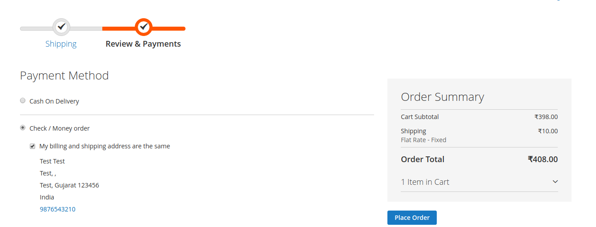

# magento2-module-place-order
Add unique "Place Order" button in the sidebar of the checkout page, instead of one button per payment method.

## Supports

- <b>Supports : Magento 2.0.x, 2.1.x, 2.2.x, 2.3.x and 2.4.x</b>

Required to run the following commands in Magento 2 root folder:

```
php bin/magento setup:upgrade
php bin/magento setup:static-content:deploy
php bin/magento cache:clean
```


### Install via zip

* [Download the latest version from GitHub](https://github.com/vrajeshkpatel/magento2-module-place-order.git)


## License

This extension is open-sourced software licensed under the [OSL 3.0 License](https://opensource.org/licenses/osl-3.0).
